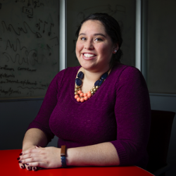

# Organizers

## Sarah M Brown - General Chair

Dr. Sarah M Brown is a Chancellor’s Postdoctoral Fellow in the Department of Electrical Engineering and Computer Science. Dr. Brown received her BS in Electrical Engineering with a minor in Biomedical Engineering in May 2011 magna cum laude, MS in Electrical and Computer Engineering in January 2014, and PhD in Electrical Engineering in December 2016 all from Northeastern University. Her graduate studies were supported by a Draper Laboratory Fellowship and a National Science Foundation Graduate Research Fellowship. Dr. Brown’s research interests are in the design and analysis of machine learning methods for scientific research, to date focusing on psychology neuroscience applications. Outside of the lab, Sarah is a passionate advocate for underrepresented STEM engagement at all levels. Currently she serves as treasurer for Women In Machine Learning and previously as finance and sponsorship chair as a co-organizer for the WiML Workshop. As a student, Sarah served in a various roles in the National Society of Black Engineers at both the local and national levels.

## Christan Grant - General Chair

Dr. Christan Grant is an Assistant Professor at the University of Oklahoma. He completed his degrees in computer science and engineering from the University of Florida. His research interests involve the union of databases and text analytics. This includes the natural language processing, relational databases, data mining, and probabilistic knowledge base assisted question answering systems. He is also building system to allow humans to work more fluently with big data algorithms. As a professor at the University of Oklahoma, in the Data Science and Analytics program, he is involved in several funded projects with the USDA, FAA, NSF, Mellon Foundation and Robert Wood Johnson Foundation.

## Dr. Omar U. Florez - Adviser Mentoring

Dr. Omar U. Florez is a Research Scientist at the Personalized Computing group at Intel Labs (Santa Clara, CA). He received his PhD in Computer Science at Utah State University and he is also a recipient of an Innovation Award on Large-Scale Analytics by IBM Research. His research interests cover statistical machine learning, recommender systems, and deep learning. He has published 20+ research publications and his prior work experience include IBM Research (2010, 2011). Dr. Florez is also co-founder of Southamericans in Computing and is board member of the Intel Latino Network (ILN).

## Heriberto Acosta - Social Media Coordinator

I've been volunteering with the BPDM since 2014 managing the social media accounts and photography duties during the workshop. I am currently a PhD Student at Nova Southeastern University. My research focuses in the area of information system security, specifically the intersection of privacy, security, and usability beliefs. I also have a Master Degree in Data Mining from the Polytechnic University of Puerto Rico. I’ve had experience in the use of data science for health analytics. During Masters Degree, I created a data mining program to find correlations in risk factors of patients with Alzheimer’s Disease. In addition to my PhD research, I am also working with Dr Patricia Ordoñez from the University of Puerto Rico in the creation of a data streaming engine for a health bioinformatics visualization program. I currently work as a civilian contractor for the Army National Guard (Puerto Rico) as an IT Site Administrator for their Distributed Learning Program.

## Orlando Ferrer - Social Media Coordinator

Orlando Ferrer is a Software Engineer with a passion for projects in data mining and machine learning. He has a B.S. in Computer Engineering from the University of Puerto Rico - Mayaguez, and a M.E. in Software Engineering from the Polytechnic University of Puerto Rico. For the past several years he has been working in the industry, consulting for aerospace companies such as Pratt & Whitney, Lockheed Martin, Cessna, Bell Helicopter, KLM, and others. In addition to data science, he has an interest in programming languages, web technologies, backend design, and automation.

## Rudy Godoy - Web Committee Chair

Rudy began his career in technology at the early age of 18. He worked for GMD, a Peruvian consulting firm, where he operated mainframe hardware and technologies such as DEC's VAX and Alpha, OpenVMS and DEC Unix. He then joined TIM Peru's Marketing Department as a Wireless Value Added Technical Consultant. He was in charge of product management and successfully launched the first SMS-based services in Peru. He later founded a Software consulting firm, acting as CEO and Product Manager. He managed to deliver software products for top financial and consulting companies in Peru. Previous to his current endeavours he worked for TIBCO Jaspersoft's Business Development unit leading technical efforts to enable Jaspersoft integrations with the latest Big Data technologies. He also successfully certified the product line with third-party vendors such as Cloudera, Databricks, Hortonworks and MongoDB. He attended to the Computer Science program at the Universidad Católica San Pablo in Peru. His research interests includes Machine Learning, Data Mining, Big Data, Cryptography and Programing.

## Ivan Brugere - Mentoring Coordinator

Ivan is a final-year Ph.D. student and ESP-IGERT Fellow in Security and Privacy at the University of Illinois at Chicago. He earned his M.S. at the University of Minnesota focusing on large-scale spatiotemporal data mining with applications in ecology and climate science. His current research focuses on measuring and evaluating graph models inferred from the data of individual entities for a particular task or data science question. His work is in applications to data-driven science, including ecology, bioinformatics, as well as web applications such as relational user modeling and recommendation. Ivan is a 2014 Google Lime Scholar for students with disabilities, and helped organize the Broadening Participation in Data Mining workshop in its 2014 and 2016 iterations.

## Jacqueline Fairley - Fundraising Chair

Jacqueline Fairley is a research engineer in the Sensors and Electromagnetic Applications Laboratory at GTRI. Her research interests include development, testing, evaluation, and real-time implementation of radar signal processing algorithms and architectures. Dr. Fairley holds a B.S. in electrical engineering from the University of Missouri-Columbia, as well as an M.S. and Ph.D. in electrical and computer engineering from the Georgia Institute of Technology.

## Caitlin Kuhlman - Chair Tutorials Committee

Ms. Kuhlman is a Ph.D. student in the Department of Computer Science at Worcester Polytechnic Institute working in the Database Systems Research Group. Her research is in the area of scalable machine learning and data mining using distributed systems. She is also focused on using public data to solve social problems. She is the lead researcher and developer on the Massachusetts Technology, Talent, and Economic Reporting System, an online tool to measure the economic competitiveness of US states, and in 2016 she was a member of the inaugural class of Data Science for Social Good Fellows at IBM Research.

## Annie En-Shiun Lee - Co-Mentoring Chair

En-Shiun Annie Lee holds a PhD from the Centre of Pattern Analysis and Machine Intelligence from the department of System Design Engineering from University of Waterloo. Dr. Lee has experience in techniques from pattern recognition, data mining, and machine learning to solve relevant problems, such as health data analysis, computational advertising, and sentiment analysis. She is interested in learning how patterns appear in text and in nature, especially what those patterns mean with respect to big data. Dr. Lee has over 8 years of experience as a researcher, and over 4 years of experience in various sectors of the industry, including software, energy, services, as well as marketing and media. Dr. Lee has published in bioinformatics, knowledge discovery, and artificial intelligence, and has filed a patent in biosequence analysis. She is a recipient of the Natural Sciences and Engineering Research Council Post Graduate Scholarship, the Ontario Graduate Scholarship, and Mitacs Accelerate Internship. Dr. Lee has served as a co-organizer for the WiML Workshop co-hosted with NIPS in Vancouver, BC, Canada, 2010.

## Reihaneh Rabbany - Mentoring Committee

Reihaneh Rabbany is a Postdoctoral Fellow at the Auton Lab, Carnegie Mellon University. She researches data mining and machine learning techniques for analyzing real-world attributed graphs. Previously, she has been a member of Alberta Innovates Center for Machine Learning. She has a Ph.D. and M.Sc. in Computing Science form University of Alberta, Canada.
 
 

## Alexander Rodriguez - Fundraising Committee

Alexander is a Master’s student in Data Science and Analytics and a graduate research assistant at the interdisciplinary Community Resilience CORE Research Lab at University of Oklahoma (OU) which is a part of the broader NIST-funded Center of Excellence on Community Resilience. His current research involves the application of machine learning techniques to assist decision making in natural disasters mitigation. He completed his B.Sc. in Mechatronics Engineering at Universidad Nacional de Ingenieria, Peru. During his undergrad, he worked on several predictive analytics projects. In his senior year, he was awarded with a scholarship to spend one year as an exchange student at OU. After graduating, he spent one year in the Maintenance Department of a LNG plant, where he experimented on the application of prognostics for some automated devices. Then he got a position on Business Intelligence for a short period before his Master's studies.

## Mariya Vasileva - Social Media Committee

Mariya Vasileva is currently a Ph.D. student in the Artificial Intelligence Group at the Department of Computer Science, University of Illinois at Urbana-Champaign. Her current research focuses on machine learning and artificial intelligence, deep learning and optimization, and statistical learning theory, primarily in application to computer vision problems. Her most recent projects have involved employing novel developments in deep learning methods for scene understanding and generative image modelling. Mariya is concurrently completing her M.S. degree in Applied Mathematics with a focus on optimization and algorithms at the University of Illinois at Urbana-Champaign. She earned her B.S. degrees in Mechanical Engineering and Business Economics from the California Institute of Technology in Pasadena, California, after which she spent a year working as an engineer at Schlumberger Technology Corporation in Houston, Texas, before proceeding to pursue her graduate studies.

## Pablo Fonseca - Social media Committee

Pablo Fonseca is a PhD Student in Machine Learning at The University of Campinas in Brazil. He earned his M.S. degree in Computer Science from University of Campinas in 2015 and his B.S. in Informatics Engineering at the Pontifical Catholic University of Peru in 2010. His research interests lie in Machine Learning and Image Processing.

## Jose Lugo-Martinez - Mentoring Committee

Dr. Jose Lugo-Martinez is a Post-doctoral Fellow in the Precision Health Initiative at Indiana University. His research interests include machine learning, data and text mining, computational biology and structural bioinformatics. He received his Ph.D. in Computer Science with a minor in Bioinformatics from Indiana University under the supervision of Predrag Radivojac. Prior to that, Dr. Lugo-Martinez received dual B.S. degrees in Computer Science and Mathematics at the University of Puerto Rico-Rio Piedras and M.S. degree in Computer Science at the University of California-San Diego. His research is focused on the development of robust kernel methods for learning and mining on noisy and complex graph and hypergraph data. In particular, he develops computational approaches towards understanding protein function and how disruption of protein function leads to disease. He is a member of the International Society for Computational Biology and a reviewer for several scientific journals and conferences.
